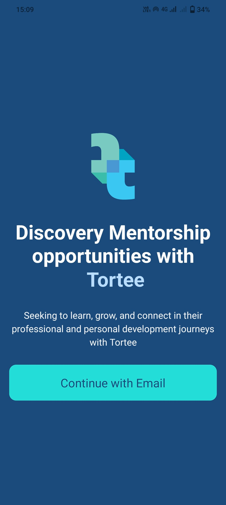

# Report PRM392 - Nhóm 2 - NJS1710

## I. Introduction:

**About:**

The TorTee Mentorship Platform is a comprehensive solution designed to connect mentors and mentees, facilitating a seamless booking process, secure payments, and an interactive workspace for both parties.

**Nhóm 2: Member**

- Châu Thị Ngọc Trâm - **Mobile**
- Vũ Thị Bích Phương - **Mobile**
- Lê Thị Yến Nhi - **Backend + Mobile**

**GitHub:**
Back-end: [https://github.com/Tortee-mobile/TorTee-server](https://github.com/Tortee-mobile/TorTee-server)
Mobile: [https://github.com/Tortee-mobile/Tortee-mobile](https://github.com/Tortee-mobile/Tortee-mobile)

## **II. Task:**

### 1. Back-end: https://github.com/Tortee-mobile/TorTee-server/blob/main/README.md

ASP.NET API

- Lê Thị Yến Nhi

### 2. Mobile:

**Lê Thị Yến Nhi:**

- Message: real-time mess using signalR, unread total message
- Login, Logout, Register,
- Welcome screen
- Email confirmation
- Real-time notification: Unread total notifications, read notifications
- Mentee Application Management: Mentee Application List, Mentee Application Detail, Accept/Denied Application

**Châu Thị Ngọc Trâm:**

- Skill Management: Add Skill, Update Skill
- Profile Management: Update profile, Update password, Upload Avatar

**Vũ Thị Bích Phương:**

- Browse mentee: View my Mentee Detail
- Browse mentor: Search mentor, View mentor list and detail mentor (mentor plan, mentor review list)
- Booking mentor using VnPay for Payment
- Search chat

**Vũ Thị Bích Phương + Châu Thị Ngọc Trâm:**

- Workspace between mentor and mentee:
  - Mentor role: My mentee, Assignment Sent, Assignment Detail, Download Assignment, Grade Submission
  - Mentee role: My mentor, Assignment Received, Assignment Detail, My submission, Send feedback

## III. UI Screen:

1. Welcome Screen:

1. Login

1. Register

1. Email Confirmation

1. Home:

1. Mentor Detail:

1. Booking Screen:

1. Workspace Mentor: (2 tabs)

1. Workspace Mentee (4 tabs)

1. Application Mentor:

1. Application Mentee:

1. Message:

1. Notification

1. Profile management:

